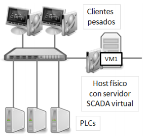

# Arquitecturas

## Arquitecturas de los sistemas SCADA

A continuación se analizan las arquitecturas que pueden utilizarse para desplegar los sistemas SCADA.

Atendiendo al criterio de **comunicación entre equipos** (PLC-servidores-clientes), una solución SCADA puede desplegarse básicamente de las siguientes formas para modelos de implantación basados en una solución a medida, en una aplicación proporcionada por una software factory, o en la utilización de software libre.
### Arquitectura Stand-alone
El software SCADA se despliega en una sola máquina, desde la que se desarrolla y ejecuta
toda la aplicación:

### Arquitectura Cliente-Servidor con Cliente Pesado

El software SCADA Servidor se despliega en uno o varios servidores en los que se ejecutan
servicios u objetos que se encargan de captar la información que proviene de los
dispositivos de campo. Estos servidores sirven esta información a clientes SCADA en los
que se ha instalado físicamente una licencia (o código) que permiten visualizar y controlar el
proceso.

### Arquitectura Cliente-Servidor con Cliente Ligero

Dentro de la arquitectura anterior, a su vez pueden observarse dos variantes:

* Aquellas que están basadas en la utilización de escritorios remotos: el
funcionamiento es similar a la arquitectura anterior. La principal diferencia es que, en
este caso, los PCs desde los que se realiza la supervisión y control son clientes
ligeros porque no es necesario instalar ningún software específico sobre ellos.
Utilizan los servicios RDS (Remote Desktop Services), o Terminal Services para
acceder a un servidor central en el que se encuentra la aplicación SCADA, que se
encarga de servir sesiones de acceso a dicha aplicación.

* Aquellas que están basadas en la utilización de clientes web: en este caso, los
clientes ligeros utilizan un explorador de Internet para ejecutar la aplicación SCADA.
Acceden a un servidor donde reside una aplicación SCADA desarrollada sobre
lenguajes de programación típicamente web (PHP, ASP, etc.).

Teniendo en cuenta esta primera clasificación, se puede realizar otro tipo de taxonomía atendiendo en este caso a la forma en que el SCADA se despliega, tendríamos:

### Arquitectura Distribuida
En las que existen, por ejemplo, servidores dedicados para gestionar las comunicaciones,
servidores utilizados para gestionar la aplicación SCADA, y servidores/PCs dedicados a
realizar las funciones de supervisión y control.

### Arquitectura Redundante
En las que se duplican los servidores con el objetivo de que en caso de caída del principal,
el secundario pueda tomar el control de la aplicación. Arquitectura típica en entornos en los
que se requiere alta disponibilidad.

### Arquitectura Virtualizada
Es decir, los sistemas SCADA pueden ser desplegados en entornos tradicionales (host
based) o en máquinas virtuales con hipervisores como VMWare o HyperV, por ejemplo:

### Arquitectura Hibrida

En las que se utilicen distintas posibilidades, con el objetivo de cubrir las necesidades
específicas de un determinado proyecto.

## Arquitecturas de los sistemas SCADA + Historizadores

Un Historizador se puede desplegar bajo múltiples tipos de
arquitecturas: 

**Ejemplo:** 
 * El historizador se ha desplegado complementando al SCADA.
 * Utilizando la arquitectura cliente-servidor con clientes pesados. En este caso las
herramientas de explotación de la información se han instalado en los clientes SCADA.
 * La captura de los datos se realiza a través del SCADA.
 * Se trata de un sistema redundante ya que existe un Historian replicado.

En relación con la redundancia del historizador, se ha de mencionar que:
 1. Como ya se ha comentado anteriormente, normalmente los datos ubicados en el servidor de
historización son accedidos por los propios operadores de planta, desde los PCs en los que
están instalados los SCADA.

 2. Sin embargo, también son accedidos por personas que no operan directamente en el
entorno industrial. Por ejemplo, un director de producción o un director de calidad, podrían
acceder desde su PC, ubicado en la red IT, directamente a este tipo de servidores.
En este caso, una buena práctica es ubicar un historizador replicado en una DMZ o zona
desmilitarizada, de manera que la red de proceso no se vea comprometida ante posibles
amenazas. Un aspecto clave es que la mayoría de historizadores ya proporcionan la posibilidad de desplegar entornos replicados que faciliten esta dualidad entre aplicativos.
